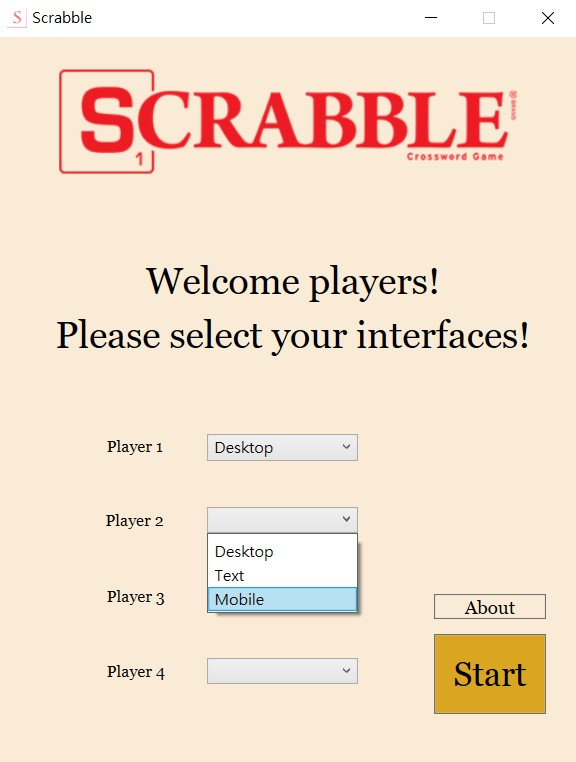
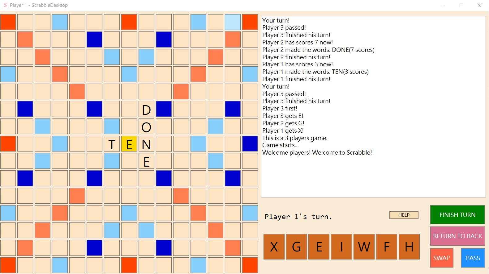
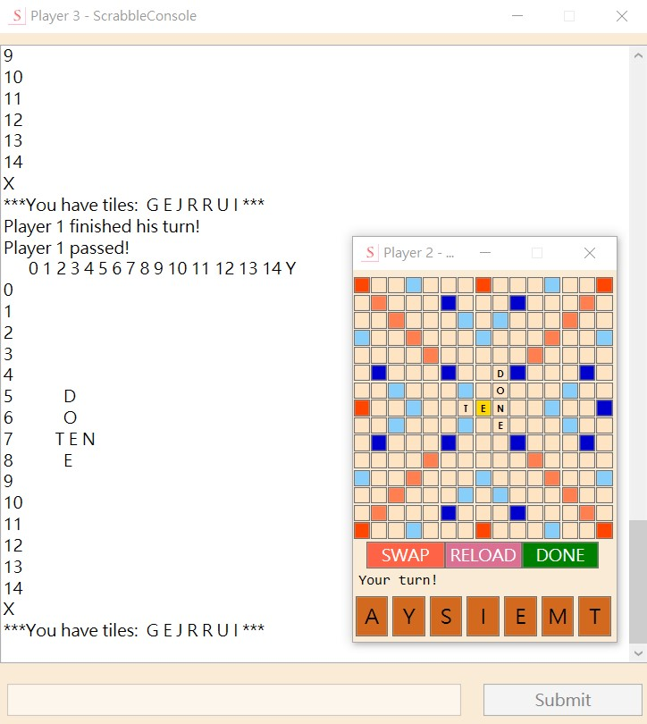

# Scrabble

This is a localized version of Scrabble game in C# originally created by poyea. The game is localized into Japanese, Chinese, and Korean by Nicole Henry, Aurora Wang, Tulsi Patel, and Linh Nguyen, translation and localization management students of Middlebury Institute of International Studies at Monterey. We hope you enjoy this localized rendition of Scrabble.

Scrabble game in C#, using <a href="https://en.wikipedia.org/wiki/Windows_Presentation_Foundation">WPF</a>. This is a standard, but imperfect 100-pieces version of Scrabble game. There are no "Challenge" option and "The Fifty Point Bonus" in this version of the game.

## Preview

Click here

  

    
    
    
    
    
    
    

  

## To build the project
You need Visual Studio ≥2019.

## If you like this, please
* Star
* Fork
* Contribute

## License
This repository is licensed under MIT License. See also [LICENSE](LICENSE) for details.
